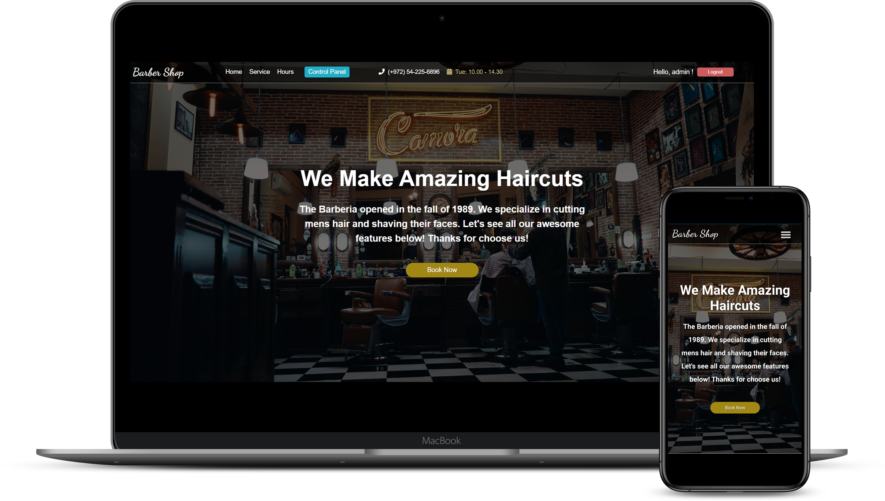

# Barbershop
Full stack web application (mobile friendly) for booking appointments at the barbershop.
In the system there are 2 type of users, regular users and administrators.
After registration and logging process users will be able to schedule, change and cancel their appointments on their profile page. 
Administrators have a control panel where they can manage all scheduled appointments and users in the system.
<br/>
**Live Demo (not mobile friendly):** https://barber-appointments.netlify.app/


### Technologies
* React at the client side
* NodeJS & Express at the server side
* MongoDB & Mongoose
* Asynchronous tasks, Axios

### How to install
Clone the repository:
```
git clone https://github.com/EliNaduyev/Barbershop.git
```
Enter the clonned folder:
```
cd Barbershop
```
Enter the client folder:
```
cd client
```
Install the dependencies:
```
npm install
```
Run the application:
```
npm start
```
Local app should open automatically, if it is not, open the browser at http://localhost:3000/
